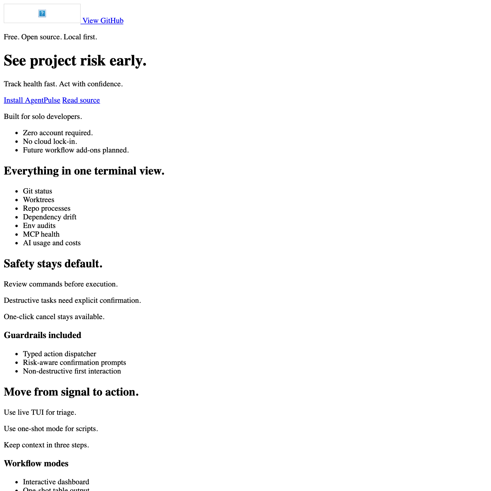

# AgentPulse

Alias in repository naming: `gitpulse`.

## What it is

Local engineering command center for repo health, worktrees, running processes, dependency drift, env checks, MCP health, and AI usage context.

## Who it is for

Solo developers and small teams who want faster triage with explicit, trust-first actions.

## Install and run

```bash
brew tap indranilbora/agentpulse https://github.com/indranilbora/agentpulse
brew install indranilbora/agentpulse/agentpulse
agentpulse
```

From source:

```bash
cargo install --path .
agentpulse --once
```

Verification:

```bash
cargo test -q
```

## Screenshots




## Landing page

- Local source: `website/index.html`
- Hosted path target: project landing via portfolio route and repo website deployment.

## Current status

Active. Core TUI and command action safety are stable.

## Roadmap

1. Better grouped recommendations.
2. Faster large-repo scans.
3. More resilient cross-platform path handling.
